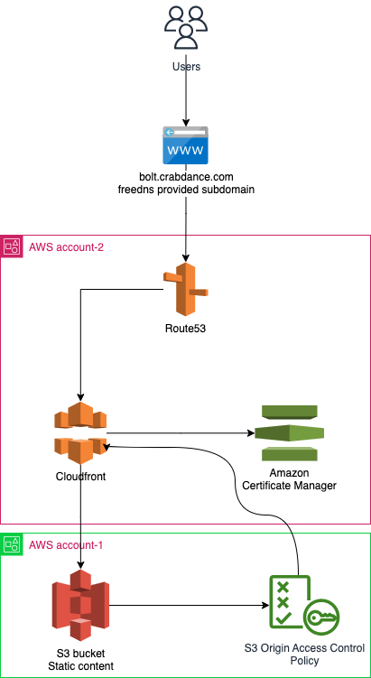

# Route53 / Cloudfront / ACM / S3 Task

## Task

Serve content from a private S3 bucket by deploying a CloudFront Distribution on a different AWS account that the S3 bucket is hosted on. Content should be served from an Alternate domain name with SSL.

## Demo

Deployed task is available under https://bolt.crabdance.com

## Prerequisites

This repository is using a tool for managing multiple terraform "stacks". The main reason for using terramate is ability to apply multiple environments and multiple different modules (Route53, S3, ACM) without duplicating code. Terramate also allows us to mantain a specific order when applying "stacks".

Below instructions are for macOS installation but these could be adapted for a Linux installation as well

You can install terramate with

```
brew install terramate
```

Please also make sure that Terraform is installed. This repository was tested on Terraform 1.3.6, but should technically work fine on any 1.x Terraform.

I use tfenv and wholeheartedly recommend it for managing multiple terraform versions, you can install it like so

```
brew install tfenv
```

and then install a version of terraform you need, in this case I chose the latest stable Terraform version

```
tfenv install 1.3.6
```

We also need to make sure that the AWS configs are configured beforehand, in my case I had these two profiles set in `~/.aws/credentials`

```
[profile bolt-account-1]
aws_access_key_id=XXX
aws_secret_access_key=XXX

[profile bolt-account-2]
aws_access_key_id=XXX
aws_secret_access_key=XXX
```

Names of profiles are customizable in `stacks/config.tm.hcl`

```
project_name = "bolt"
account_name_1 = "account-1"
account_name_2 = "account-2"
```

and then in each corresponding account in `stacks/account-1/config.tm.hcl` we have

```
account_name = "${global.account_name_1}"
terraform_provider_aws_config_profile = "${global.project_name}-${global.account_name}"
```

## Infrastructure

### Components


**Any domain or subdomain**

In this case I used a free subdomain provided by https://freedns.afraid.org/. In this case I used a **bolt.crabdance.com** but you can use any domain or subdomain, please make sure to swap `domain_name` beforehand in `stacks/config.tm.hcl`.

**Route53** [Account 2]

We will be pointing our new domain or subdomain to route53 provided name servers. We use route53 just because it's more tightly integrated and we can manage it through Terraform both for DNS validation and to point domain to Cloudfront distribution automatically upon creation of Cloudfront

**Amazon Certificate Manager** [Account 2]

Amazon Certificate Manager allows us to generate a free Amazon provided public certificate which we will be able to use it in Cloudfront to get free SSL.

**Cloudfront** [Account 2]

Cloudfront is the CDN provided by AWS, it allows us to cut traffic costs and speed up content delivery. It also allows us to point it to S3 bucket without opening up S3 bucket publicly via use of Origin Access Control Policy (something we will be leveraging here)

**S3 Bucket** [ Account 1]

This is a private S3 bucket which have a Origin Access Control policy to allow access only from a cloudfront distribution in previous step

### Structure

The terramate project is structured as follows

```
├── README.md
├── bolt-task.drawio
├── bolt-task.drawio.png
├── modules
│   ├── acm                       # ACM public certificate + route53 records
│   │   └── acm.tm.hcl
│   ├── cloudfront                # Cloudfront distribution module
│   │   └── cloudfront.tm.hcl
│   ├── route53                   # Route53 module which creates a public zone
│   │   └── route53.tm.hcl
│   └── s3-bucket                 # s3-bucket module, used for all s3 buckets
│       └── bucket.tm.hcl
├── stacks
│   ├── account-1
│   │   ├── config.tm.hcl         # account-1 wide global config.tm.hcl
│   │   ├── static-bucket
│   │   │   ├── config.tm.hcl     # S3 Static bucket global variables and module import
│   │   │   ├── files
│   │   │   │   └── index.html    # This is default index object for static bucket
│   │   │   └── stack.tm.hcl
│   │   └── tfstate-bucket        # Terraform state bucket for account 1
│   │       ├── config.tm.hcl     # Terraform state bucket variables and module import
│   │       ├── stack.tm.hcl
│   │       ├── terraform.tfstate
│   ├── account-2
│   │   ├── acm
│   │   │   ├── config.tm.hcl     # ACM wide global variables and module import
│   │   │   └── stack.tm.hcl
│   │   ├── cloudfront
│   │   │   ├── config.tm.hcl     # Cloudfront wide global variables and module import
│   │   │   └── stack.tm.hcl
│   │   ├── config.tm.hcl          # Account 2 wide global variables
│   │   ├── route53
│   │   │   ├── config.tm.hcl      # Route53 wide global variables
│   │   │   └── stack.tm.hcl
│   │   └── tfstate-bucket         # Terraform state bucket for account 1
│   │       ├── config.tm.hcl      # Terraform state global variables and module import
│   │       ├── stack.tm.hcl
│   │       ├── terraform.tfstate
│   ├── backend.tm.hcl             # Generate backend file for each stack
│   ├── config.tm.hcl              # Global variables
│   └── providers.tm.hcl           # Generate providers file for each stack
└── terramate.tm.hcl
```

It's important to mention that terramate allows us manage variables or as terramate call it "globals" on any level, so globals set in /config.tm.hcl will be available in all stacks unless it was overriden somewhere along the line. The globals set in /stacks/account-2/cloudfront/config.tm.hcl will only be available there. The globals set in /stacks/account-2 will be applied for all stacks inside account-2.

All modules are structured in `modules` directory. These would normally be each in it's own separate repository however here for presentation purposes I think it makes sense to just have everything in one repo so I wouldn't send you a test task consisting of 5 repositories. As for modules, all modules except S3 bucket are self written.

I have also omited all terramate generated files from the list above (they all start with _generated prefix), just so it's easier to read, however I opted in for keeping them in the repository here just so you are able to see the actual generated terraform code without digging into terramate or running terramate generate yourself. Normally I wouldn't store generated code in repository.

stacks folder allows us to split the terraform into any logical pieces we want, stacks can be as nested as we want, in this case since we have a requirement for two AWS accounts, I felt having per account structure makes sense.

AWS account 1 hosts only S3 bucket, while AWS account 2 hosts Route53, Cloudfront and ACM. Everything is deployed in eu-north-1 (Stockholm) since it's a closest and likely the least latency region to us. Some infrastructural stuff such as ACM certificate has to be configured in us-east-1 as it's an administration region for AWS and only certificates in us-east-1 can be chosen for Cloudfront.

### Diagram



## Installation instructions

Install all prerequisites

---

Generate terraform code (not really needed here as it's up to date but needed for local development) using this command

```
$ terraform generate
```
---
Run terraform init in state folders first

```
$ terraform -chdir=stacks/account-1/tfstate-bucket init
$ terraform -chdir=stacks/account-2/tfstate-bucket init
```

and then terraform apply

```
$ terraform -chdir=stacks/account-1/tfstate-bucket apply -auto-approve
$ terraform -chdir=stacks/account-2/tfstate-bucket apply -auto-approve
```

> **Note**
>
> Normally I would store the tfstate buckets each in a separate repo, so having the manual steps above wouldn't normally be required. But since here for presentation purposes we store the tfstate buckets in same repository so that involes jumping some hoops and creating tfstate buckets first.

---

Run terraform apply for all stacks while being located in either root folder of the project or in stacks folder

```
$ terramate run terraform apply -auto-approve
```

> **Note**
>
> When running terramate run terraform **anything** it follows a certain orders as set in stack.tm.hcl with before and after directives. If we run the `terramate experimental run-order` command we will see order as follows
>
> - /stacks/account-1/tfstate-bucket
> - /stacks/account-1/static-bucket
> - /stacks/account-2/tfstate-bucket
> - /stacks/account-2/route53
> - /stacks/account-2/acm
> - /stacks/account-2/cloudfront
>
> Which is exactly what we need because Cloudfront depends on both, static bucket, tfstate buckets, route53 and ACM.

After first run, please take `route53_name_servers` output from route53 stack and add them to your domain or subdomain name servers. It will be stuck on `aws_acm_certificate_validation.acm_verification` stage until you switch over DNS and these changes are propagated.

Once everything is installed then the website should be HTTPS enabled and accessible by your domain, in this case at https://bolt.crabdance.com
